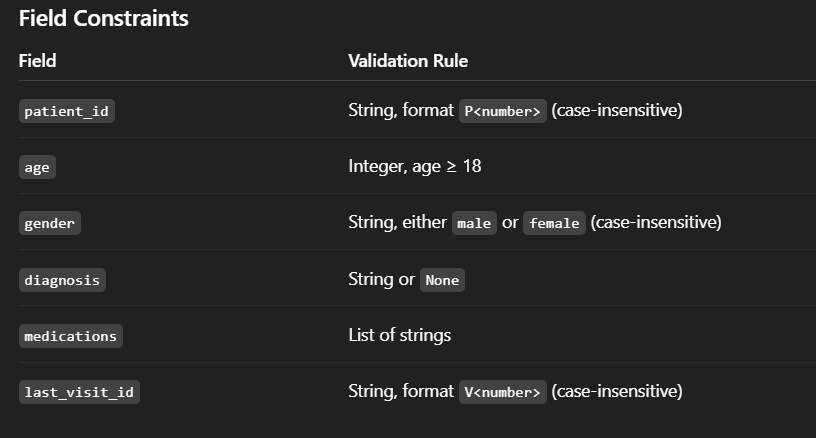

# fcc-learnings
learnings from fcc python certifications
1. normal rpg calculator
 This Python script provides a character creation tool that validates name requirements and stat distributions (Strength, Intelligence, and Charisma) before generating a visual "stat bar" character sheet.
## Character Creator Tool### FeaturesName Validation: Ensures names are strings, not empty, under 11 characters, and contain no spaces.Stat Enforcement: Validates that all stats are integers between 1 and 4.Point Balance: Ensures the total sum of stats is exactly 7 points.Visual Output: Generates a formatted string with "dot" progress bars representing each attribute.### How It WorksThe create_character function takes four arguments: name, strength, intelligence, and charisma. It runs a series of checks before returning the final character sheet.#### Validation RulesRuleRequirementName TypeMust be a stringName Length1 to 10 charactersNo SpacesName cannot contain " "Stat TypeStrength, Intelligence, and Charisma must be intStat RangeEach individual stat must be between 1 and 4Total PointsSum of all stats must equal exactly 7### Example UsagePython
# Create a valid character
print(create_character('Ren', 4, 2, 1))

# Output:
# Ren
# STR ●●●●○○○○○○
# INT ●●○○○○○○○○
# CHA ●○○○○○○○○○
### Error HandlingIf the inputs do not meet the requirements, the function returns a helpful string explaining the issue:"The character name is too long""The character should start with 7 points""All stats should be no less than 1"### InstallationCopy the code into a Python file (e.g., character.py).Run the script using Python 3:Bashpython character.py
2. Medical_data_validator
Medical Data Validator (Python)
Overview

This project implements a medical records validation system in Python.
It validates structured patient data against predefined rules and reports any records that violate expected formats or constraints.

The validator is designed to simulate real-world data preprocessing, a critical step in data engineering, analytics, and machine learning pipelines.
Features

Validates a list of medical records (dictionaries)

Checks for:

Correct data structure

Required keys

Data type correctness

Value constraints

Case-insensitive ID formats using regular expressions

Reports detailed validation errors with record positions

Returns an overall validation status
Data Validation Rules

Each medical record must contain exactly the following keys:
patient_id
age
gender
diagnosis
medications
last_visit_id

How It Works
1. find_invalid_records(...)

Accepts individual record fields as keyword arguments

Applies validation rules using Python type checks and regex

Returns a list of invalid field names

2. validate(data)

Accepts a list of medical records

Verifies:

Input is a sequence

Each item is a dictionary

Keys match the required schema

Calls find_invalid_records() for each record

Prints detailed error messages

Returns True if all records are valid, otherwise False